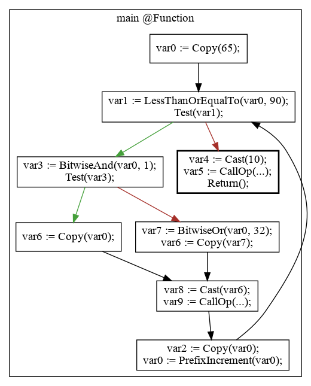
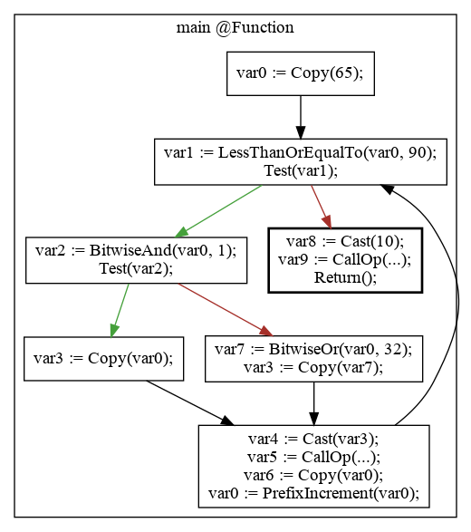

# o10c

The **o10 compiler** (o10c for short) is a compiler for a subset of the C programming language. Features include:

* Compilation to GNU Assembler (GAS) files, with support for the following architectures:
  * x86-64
* Graphviz intermediate representation graph generation
* Abstract syntax tree export to JSON format
* Optional IR optimization
* Linux and Windows compilation support (OS X should also be supported, but has not been tested)

## Requirements

If you just want to build the project, you will only need the _build dependencies_.
The test dependencies are required for unit tests, coverage analysis and memory leak checks (`make test`).

The project is continuously tested with [this docker image](https://raw.githubusercontent.com/demurgos/docker-cpp/master/insa-gcc-5/Dockerfile).

You can start a session with the environment of the Docker image above by running
the following command in an empty directory:

```shell
# Run as a normal user
docker run --interactive --tty --volume "$(pwd):$(pwd)" demurgos/cpp:insa-gcc-5 /bin/bash
```

Then, you can get the project (`git clone <repo_uri>`) and follow the build steps.

### Build dependencies

- _CMake_ 2.8
- _g++_ 5
- _git_ 2
- _GNU Make_

### Test dependencies

- _lcov_
- _Python_ 3
- _valgrind_
- _clang_ (optional)

## Configure and build

Note: if you are using Windows, you may have to manually specify the paths to the `bison` and `flex` executables on your system.
To do so, specify the `BISON_EXECUTABLE` and `FLEX_EXECUTABLE` variables when running CMake.

```shell
# Run as a normal user
# Install the dependencies
make prepare

# Build all the targets of the project
# (Use `make-insa` at INSA)
make
```

Note: on INSA machines, replace all uses of `make` with `./make-insa` (the parameters are unchanged).

You will get the following artifacts:

- **build/o10c**: The compiler executable
- **build/comp_test**: The executable that runs the unit-tests
- **build/src/lib/libcomp.a**: The compiler library, the headers are in **include/**

## Run

### Full compilation

To run the compiler, run the `build/o10c` executable from the command-line. You can use the `-h` flag for information about its usage.

If you only want to compile an executable and have GCC installed, run the `o10c.sh` script instead. It takes two parameters:
- a C source file to compile
- the name of the executable file to produce

Example: `./o10c.sh my_program.c my_program`

### Emit the AST

Generate a JSOn view of the IR:

```
./build/o10c --ast main.c
```

### Emit the IR

Generate a Dot representation of the IR:

```
./build/o10c --ir main.c
```

You can then render it:

```
./build/o10c --ir main.c > main.dot
dot -Tpng -o main.png main.dot
```

### Emit the assembly

```
# Standard
./build/o10c -c --output="main.asm" main.c
# Optimized
./build/o10c -co --output="main.asm" main.c
```

## Test

```shell
# Run as a normal user
make test
```

This will run the unit-tests once, then run them again with _Valgrind_ and then build
the main executable and run the end-to-end tests.

You can run each step individually with the following commands:

```shell
# Run as a normal user
make test.unit
make test.memory
make test.end-to-end
```

Finally, you can also run the unit tests with test coverage analysis with:

```shell
make coverage
```

Note: on INSA machines, replace all uses of `make` with `./make-insa` (the parameters are unchanged).

## Example

**main.c**

```c
void main() {
  for (int64_t cur = 'A'; cur <= 'Z'; cur++) {
    putchar(cur & 1 ? cur : cur | 32);
  }
  putchar('\n');
}
```

**main.ast.json**

```json
{
"node_type": "Program",
"body": [{
  "node_type": "Function",
  "identifier": {"node_type": "Identifier", "name": "main"},
  "return_type": { "node_type": "IdentifierDataType",
    "identifier": {"node_type": "Identifier", "name": "void"}},
  "parameters": [],
  "body": {
    "node_type": "BlockStatement",
    "body": [
      {
        "node_type": "ForStatement",
        "initializer": {"node_type": "DeclarationForInitializer",
          "declaration": {"node_type": "VariableDeclaration",
            "data_type": {"node_type": "IdentifierDataType",
              "identifier": {"node_type": "Identifier", "name": "int64_t"}},
            "declarators": [{
              "node_type": "VariableDeclarator",
              "declarator": {"node_type": "IdentifierDeclarator",
                "identifier": {"node_type": "Identifier", "name": "cur"}},
                "initial_value": {"node_type": "Uint8Literal", "value": 65}}]}},
        "test": {"node_type": "BinaryExpression",
          "op": "<=",
          "left": {"node_type": "Identifier", "name": "cur"},
          "right": {"node_type": "Uint8Literal", "value": 90}},
        "update": {"node_type": "UnaryExpression",
          "op": "PostfixIncrement",
          "expression": {"node_type": "Identifier", "name": "cur"}},
        "body": {"node_type": "BlockStatement",
          "body": [{"node_type": "ExpressionStatement",
            "expression": {"node_type": "CallExpression",
              "callee": {"node_type": "Identifier", "name": "putchar"},
              "arguments": [{"node_type": "ConditionalExpression",
                "test": {"node_type": "BinaryExpression",
                  "op": "&",
                  "left": {"node_type": "Identifier", "name": "cur"},
                  "right": {"node_type": "Int64Literal", "value": 1}},
                "consequence": {"node_type": "Identifier", "name": "cur"},
                "alternative": {"node_type": "BinaryExpression",
                  "op": "|",
                  "left": {"node_type": "Identifier", "name": "cur"},
                  "right": {"node_type": "Int64Literal", "value": 32}}}]}}]}},
      {
        "node_type": "ExpressionStatement",
        "expression": { "node_type": "CallExpression",
          "callee": {"node_type": "Identifier", "name": "putchar"},
          "arguments": [{"node_type": "Uint8Literal", "value": 10}]}}]}}]}
```

IR (normal)




IR (optimized)



ASM

```asm
	.text
	.global main
main:
	pushq %rbp
	movq %rsp, %rbp
	subq $80, %rsp
	movq $65, (-8)(%rbp)
	jmp .L1
.L1:
	movq (-8)(%rbp), %rax
	cmpq $90, %rax
	setle %al
	movzbq %al, %rax
	movq %rax, (-64)(%rbp)
	movq (-64)(%rbp), %rax
	cmpq $0, %rax
	je .L4
	jmp .L3
.L2:
	movq (-8)(%rbp), %rax
	movq %rax, (-16)(%rbp)
	movq (-8)(%rbp), %rax
	incq %rax
	movq %rax, (-8)(%rbp)
	jmp .L1
.L3:
	movq (-8)(%rbp), %rax
	andq $1, %rax
	movq %rax, (-32)(%rbp)
	movq (-32)(%rbp), %rax
	cmpq $0, %rax
	je .L6
	jmp .L5
.L4:
	movq $10, (-80)(%rbp)
	movq (-80)(%rbp), %rdi
	callq putchar
	movq %rax, (-72)(%rbp)
	leaveq
	retq
.L5:
	movq (-8)(%rbp), %rax
	movq %rax, (-48)(%rbp)
	jmp .L7
.L6:
	movq (-8)(%rbp), %rax
	orq $32, %rax
	movq %rax, (-40)(%rbp)
	movq (-40)(%rbp), %rax
	movq %rax, (-48)(%rbp)
	jmp .L7
.L7:
	movq (-48)(%rbp), %rax
	movq %rax, (-56)(%rbp)
	movq (-56)(%rbp), %rdi
	callq putchar
	movq %rax, (-24)(%rbp)
	jmp .L2
```

## License

[AGPL3](./LICENSE.md)
